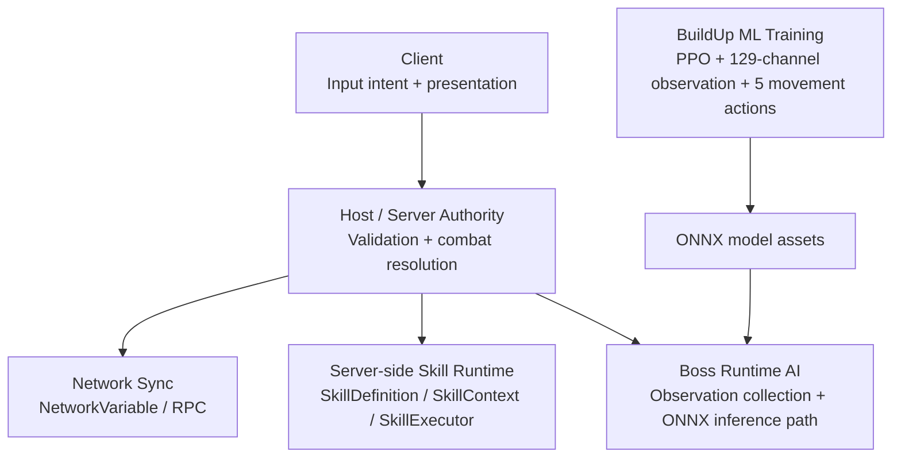

# ArenaCombat_server

> Host-authoritative 2-player co-op boss fight runtime with server-side combat/skill resolution and an ONNX-based boss movement AI integration path.

ArenaCombat_server is a Unity multiplayer gameplay project focused on a 2-player co-op boss fight runtime. Clients send gameplay intent instead of final state, while the host validates requests, resolves combat and skill effects, and synchronizes authoritative state through Unity Netcode for GameObjects.

Boss movement policies are trained in the related [BuildUp ML Training](#related-project-buildup-ml-training) project and imported into this runtime as ONNX model assets. The ML model focuses on movement decisions, while skill execution, combat rules, and multiplayer authority remain in the runtime.

## Highlights

- Host-authoritative multiplayer runtime for a 2-player co-op boss fight.
- Server-side validation for gameplay intent, combat requests, skill use, and synchronized state.
- Data-driven auto-cast skill system built around shared skill definitions and execution context.
- ONNX model assets placed in the runtime project for boss movement inference.
- AI-assisted development harness using Claude for implementation drafts and Codex for review.

## Tech Stack

| Area | Version / Tool |
| --- | --- |
| Engine | Unity `6000.3.11f1` |
| Networking | Netcode for GameObjects `2.11.2` |
| Transport | Unity Transport `2.7.2` |
| Input | Unity Input System `1.19.0` |
| Rendering | URP `17.3.0` |
| Services | Relay `1.0.5`, Lobby `1.3.0`, Authentication `3.6.1` |
| ML Runtime | Unity ML-Agents `4.0.2`, ONNX model assets |

## Architecture

## Core Systems

### Host-Authoritative Multiplayer

The runtime avoids trusting client-side final state. Clients send gameplay intent, and the host validates requests before resolving movement, combat, skill effects, and synchronized state.

Evidence in the project:

- `Assets/ArenaCombat/Scripts/Core/Network/` - 17 C# files.
- `Assets/ArenaCombat/Docs/NETWORK_ARCHITECTURE.md`
- `Assets/ArenaCombat/Docs/PROJECT_STRUCTURE.md`

### Combat & Skill Runtime

Combat and skills are resolved on the authoritative side. The skill system separates data definitions from runtime execution so multiple skill types can share a common execution path.

Key areas:

- `Assets/ArenaCombat/Scripts/Core/Combat/` - 5 C# files.
- `Assets/ArenaCombat/Scripts/Core/Skill/` - 19 C# files.
- `Assets/ArenaCombat/Docs/SKILL_SYSTEM_DESIGN.md`

### Boss AI Integration

Boss AI is designed as a hybrid runtime structure. Movement policy can be provided by ONNX model assets, while skill execution, combat rules, and multiplayer authority remain in the server-authoritative runtime.

Key areas:

- `Assets/ArenaCombat/Scripts/Core/AI/` - 12 C# files.
- `Assets/ML-Agents/`
- `Assets/onnx_9matchup/`
- `Assets/ArenaCombat/Docs/BUILDUP_INTEGRATION_PLAN.md`
- `Assets/ArenaCombat/Docs/ML_TRAINING_REFERENCE.md`

### AI-Assisted Development Harness

The project includes an AI-assisted development workflow that separates implementation and review:

- Claude Code: implementation drafts, documentation updates, architecture proposals.
- OpenAI Codex: independent review of proposed changes.
- `codex-review/pending.md`: change proposal and review gate.
- `codex-review/history/`: 99 task-level review/archive records.
- `codex-review/CODEX_PROTOCOL.md`: Codex review protocol.
- `codex-review/codex-session-prompt.md`: Codex session context prompt.

This is presented as a development-process asset, not as a replacement for manual validation.

## Related Project: BuildUp ML Training

BuildUp is a separate Unity ML-Agents project used to train the boss movement policy for this runtime.

BuildUp focuses on:

- PPO-based movement policy training.
- 129-channel observation design.
- 5 discrete movement actions.
- matchup-based training analysis.
- ONNX export and runtime alignment with ArenaCombat_server.

Repository link: `https://github.com/paek678/BuildUp`

## Documentation

- [Portfolio Overview](docs/portfolio/overview.md)
- [Multiplayer Runtime](docs/portfolio/multiplayer-runtime.md)
- [Combat & Skill System](docs/portfolio/combat-skill-system.md)
- [Boss AI Integration](docs/portfolio/boss-ai-integration.md)
- [AI Development Harness](docs/portfolio/ai-development-harness.md)

## Current Status

This repository is a portfolio/runtime project, not a finished commercial game.

Verified from local project files:

- Unity project and package versions are present.
- Networking, skill, combat, and AI runtime code folders exist.
- ONNX model assets exist in the runtime project.
- AI review/archive workflow files exist.

Needs separate validation before stronger public claims:

- final playable demo video
- latency and multiplayer stress testing
- exact runtime behavior of each imported ONNX model
- final skill count and balance state

