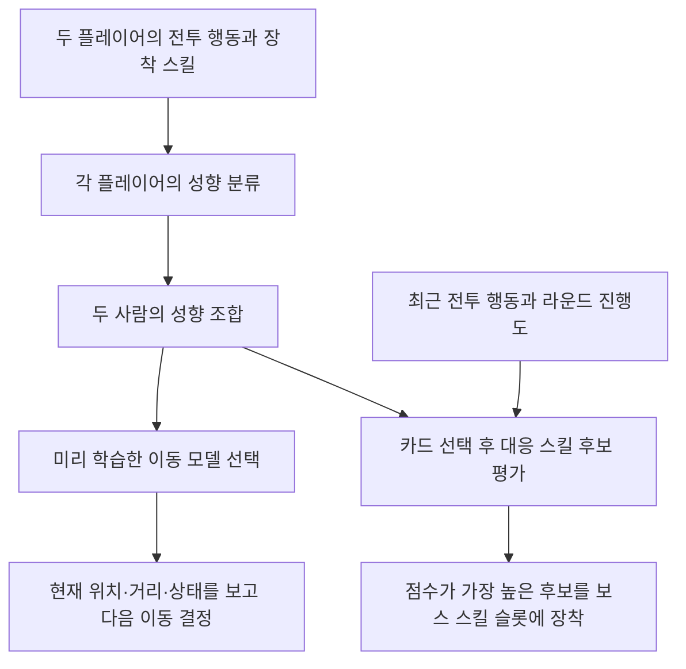

# 테네브리스(Tenebris) | 2인 협동 보스전

두 플레이어가 한 팀이 되어 보스를 상대하는 Unity 기반 3D 탑다운 액션 게임입니다. 보스는 두 사람이 얼마나 가까이에서 싸우고 어떤 스킬을 쓰는지 관찰합니다. 두 사람의 전투 성향에 따라 보스의 이동 방식과 다음에 사용할 수 있는 스킬 구성이 달라집니다.

## 한 판의 흐름

1. **방 만들기와 참가** — 한 명이 방을 열고 다른 한 명이 참가합니다. 방을 연 플레이어가 호스트를 맡습니다.
2. **협동 전투** — 두 플레이어가 보스를 공격하는 동안 호스트가 공격과 스킬 효과를 판정하고, 그 결과를 두 화면에 동기화합니다.
3. **카드 선택** — 플레이어가 카드를 골라 스킬을 구성합니다. 카드 선택이 끝나면 보스도 두 플레이어의 성향과 최근 전투 행동을 반영해 대응 스킬을 고릅니다.

## 보스는 어떻게 대응하나요?

보스는 근접 공격, 보스와의 거리, 사용하거나 장착한 스킬을 바탕으로 각 플레이어를 **근접형·원거리형·군중제어형·혼합형**으로 분류합니다. 두 사람의 성향 조합은 이동 모델을 고를 때와 대응 스킬을 고를 때 모두 사용합니다.

```mermaid
flowchart TD
    A["두 플레이어의 전투 행동과 장착 스킬"] --> B["각 플레이어의 성향 분류"]
    B --> C["두 사람의 성향 조합"]
    C --> M["미리 학습한 이동 모델 선택"]
    M --> N["현재 위치·거리·상태를 보고 다음 이동 결정"]
    C --> S["카드 선택 후 대응 스킬 후보 평가"]
    R["최근 전투 행동과 라운드 진행도"] --> S
    S --> T["점수가 가장 높은 후보를 보스 스킬 슬롯에 장착"]
```

이동 모델은 [BuildUp](https://github.com/paek678/BuildUp)에서 미리 학습합니다. 게임에서는 성향 조합에 맞는 모델을 불러와 다음 이동을 결정하며, 보스가 행동 중이면 교체를 보류합니다. 스킬 선택은 가중치 규칙이, 피해 판정은 호스트의 전투 코드가 담당합니다.

## 개발 정보

| 항목 | 내용 |
| --- | --- |
| 개발 | 빌드업 · 백성열 |
| 개발기간 | 2026.03.30 ~ 2026.06.07 |
| 게임 엔진 | Unity 6000.3.11f1 |
| 멀티플레이 | Netcode for GameObjects · Unity Transport · Lobby · Relay · Authentication |
| 보스 이동 AI | Unity ML-Agents · ONNX 모델 추론 |

## 코드와 문서

- [보스 AI 연동](docs/portfolio/boss-ai-integration.md) · [게임에 포함된 이동 모델](Assets/onnx_9matchup/) · [학습 프로젝트 BuildUp](https://github.com/paek678/BuildUp)
- [멀티플레이 실행 구조](docs/portfolio/multiplayer-runtime.md) · [전투와 스킬 시스템](docs/portfolio/combat-skill-system.md)
- [프로젝트 개요](docs/portfolio/overview.md) · [개발·검토 기록](docs/portfolio/ai-development-harness.md)
