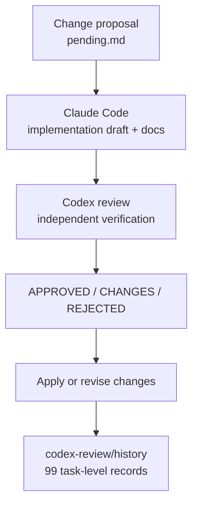

# AI-Assisted Development Harness

## Goal

The project includes a development workflow where AI tools are used with separated roles.

This should be presented as a development-process strength, not as a claim that AI replaced engineering judgment.

## Workflow



## Verified Project Evidence

- `codex-review/pending.md`
- `codex-review/CODEX_PROTOCOL.md`
- `codex-review/README.md`
- `codex-review/codex-session-prompt.md`
- `codex-review/history/` - 99 Markdown archive files
- `.mcp.json`
- `.claude/settings.local.json`

## Portfolio Wording

```text
The project used an AI-assisted development harness where implementation drafts and independent review were separated. Claude was used for implementation and documentation work, while Codex was used as a review gate for proposed changes. This helped surface authority, synchronization, and unverified-assumption risks before changes were treated as final.
```

## Why It Matters

Multiplayer gameplay code is sensitive to authority boundaries, state synchronization, and small assumptions. The harness gives the project a traceable review workflow rather than a loose "AI generated code" story.

