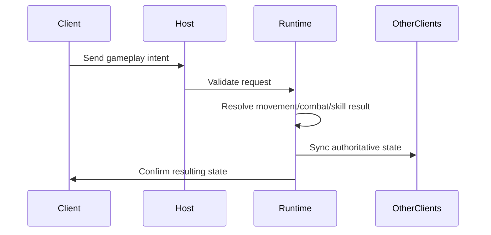

# Multiplayer Runtime

## Goal

The multiplayer runtime is designed around host-authoritative gameplay.

Clients should not directly decide final gameplay state. Instead, they send intent and the host resolves the result.

## Core Flow



## What This Shows

- understanding of multiplayer authority boundaries
- client intent vs. authoritative state separation
- server-side validation mindset
- state synchronization through NGO primitives

## Verified Project Evidence

- Unity Netcode for GameObjects `2.11.2`
- Unity Transport `2.7.2`
- `Assets/ArenaCombat/Scripts/Core/Network/`
- `Assets/ArenaCombat/Docs/NETWORK_ARCHITECTURE.md`

## Safe Portfolio Wording

```text
The runtime uses a host-authoritative model where gameplay intent is validated and resolved by the host before synchronized state is sent back to clients.
```

Avoid:

```text
dedicated server MMO
complete anti-cheat
commercial-grade netcode
```

